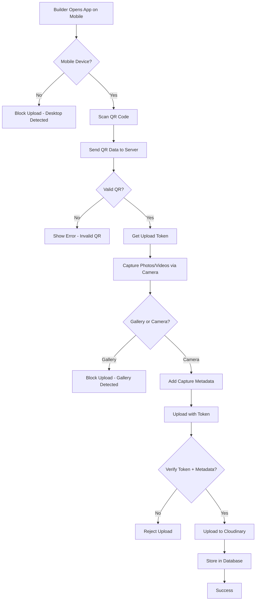

# Secure Construction Update Upload System

## 📋 Overview

This system implements a highly secure, QR-code-based construction update upload mechanism that ensures authenticity and prevents fake updates. It requires mobile device usage and camera-only capture to verify that uploads are legitimate construction progress photos/videos.

---

## 🔒 Security Features

### 1. **Mobile Device Detection**
- **Desktop/Laptop Blocking**: Uploads are only allowed from mobile devices (smartphones/tablets)
- **User Agent Verification**: Server checks HTTP User-Agent header
- **Device Info Validation**: Client sends device information (platform, user agent)
- **Error Code**: `DESKTOP_UPLOAD_BLOCKED`

### 2. **QR Code Verification**
- **Unique QR Codes**: Each milestone and property has a unique QR code
- **Format**: `milestone:<project_id>:<milestone_id>:<token>` or `property:<project_id>:<property_id>:<token>`
- **Secret Hash**: SHA-256 hash used as verification token
- **Time-bound**: QR codes can be regenerated if compromised

### 3. **Camera-Only Capture**
- **Gallery Blocked**: Only camera-captured media accepted
- **Capture Metadata Required**: Client must send `camera_captured: true`
- **Real-time Validation**: Server checks capture metadata before upload
- **Error Code**: `GALLERY_UPLOAD_BLOCKED`

### 4. **Upload Restrictions**
| Entity Type | Max Images | Max Videos | Max Image Size | Max Video Size |
|-------------|------------|------------|----------------|----------------|
| Milestone   | 10         | 5          | 10MB           | 50MB           |
| Property    | 15         | 5          | 10MB           | 50MB           |

### 5. **Metadata Enrichment**
All uploads include:
- **Device Information**: Platform, user agent, mobile flag
- **Capture Metadata**: Camera flag, timestamp, GPS (if permitted)
- **Upload Verification**: QR verified flag, upload token
- **Timestamp**: Server-side timestamp
- **SHA-256 Hash**: File integrity verification

---

## 📱 Upload Flow



---

## 🛠️ Implementation

### Backend (Django)

#### 1. **Models** (`projects/models.py`)

```python
class ConstructionMilestone(models.Model):
    # ... existing fields ...
    qr_code_data = models.CharField(max_length=500, blank=True, null=True, unique=True)
    qr_code_secret = models.CharField(max_length=128, blank=True, null=True)
    
    def save(self, *args, **kwargs):
        if not self.qr_code_data:
            self.qr_code_data = f"milestone:{self.project.id}:{self.id}:{uuid.uuid4().hex[:8]}"
            secret_string = f"{self.id}:{self.project.id}:{self.title}:{uuid.uuid4().hex}"
            self.qr_code_secret = hashlib.sha256(secret_string.encode()).hexdigest()
        super().save(*args, **kwargs)
```

#### 2. **API Endpoints**

##### **QR Verification** (`POST /api/projects/milestones/verify_qr/`)
- Verifies QR code data
- Checks mobile device
- Returns upload token and restrictions
- No permission required (authenticated only)

**Request:**
```json
{
  "qr_data": "milestone:123:456:abc123",
  "device_info": {
    "is_mobile": true,
    "user_agent": "Mozilla/5.0...",
    "platform": "Android"
  }
}
```

**Response:**
```json
{
  "verified": true,
  "entity_type": "milestone",
  "entity_id": "456",
  "project_name": "Prestige Heights",
  "title": "Foundation & Excavation",
  "upload_token": "a1b2c3d4...",
  "upload_endpoint": "/api/projects/milestones/456/secure_upload/",
  "restrictions": {
    "camera_only": true,
    "max_images": 10,
    "max_videos": 5,
    "max_image_size_mb": 10,
    "max_video_size_mb": 50
  }
}
```

##### **Secure Upload** (`POST /api/projects/milestones/{id}/secure_upload/`)
- Validates upload token
- Checks mobile device
- Verifies camera capture metadata
- Uploads to Cloudinary
- Stores in database with metadata

**Request (FormData):**
```
upload_token: "a1b2c3d4..."
device_info: {JSON}
capture_metadata: {
  "camera_captured": true,
  "capture_time": "2025-11-09T12:34:56Z"
}
description: "Foundation work completed"
images: [File, File, ...]
videos: [File, ...]
```

**Response:**
```json
{
  "success": true,
  "milestone": {...},
  "uploaded_images": 3,
  "uploaded_videos": 1,
  "message": "Media uploaded successfully with QR verification"
}
```

#### 3. **Error Codes**

| Code | Message | Description |
|------|---------|-------------|
| `DESKTOP_UPLOAD_BLOCKED` | Upload is only allowed from mobile devices | Desktop/laptop detected |
| `GALLERY_UPLOAD_BLOCKED` | Only camera-captured media is allowed | Gallery upload attempted |
| `INVALID_QR_CODE` | Invalid QR code or entity not found | QR data doesn't match any entity |
| `INVALID_UPLOAD_TOKEN` | Invalid upload token | Token doesn't match QR secret |
| `UNAUTHORIZED_DEVELOPER` | You are not the developer for this project | User is not project developer |

---

### Frontend (React)

#### 1. **SecureUpload Component** (`components/SecureUpload.tsx`)

**Features:**
- 5-step wizard: Scan → Verify → Capture → Upload → Success
- Mobile device detection
- QR scanner integration
- Camera-only file input
- Progress indicator
- Error handling

**Usage:**
```tsx
import SecureUpload from '@/components/SecureUpload';

<SecureUpload onSuccess={() => console.log('Upload complete')} />
```

#### 2. **QRCodeDisplay Component** (`components/QRCodeDisplay.tsx`)

**Features:**
- Displays QR code for printing
- Print-optimized view
- Download as PNG
- Security instructions
- Entity information

**Usage:**
```tsx
import QRCodeDisplay from '@/components/QRCodeDisplay';

<QRCodeDisplay
  entityType="milestone"
  entityId="123"
  projectName="Prestige Heights"
  title="Foundation Work"
  qrCodeData="milestone:proj123:mil456:token789"
/>
```

#### 3. **Camera Input Configuration**

```html
<!-- Camera-only image input -->
<input
  type="file"
  accept="image/*"
  capture="environment"  <!-- Use rear camera -->
  multiple
  onChange={handleImageCapture}
/>

<!-- Camera-only video input -->
<input
  type="file"
  accept="video/*"
  capture="environment"
  onChange={handleVideoCapture}
/>
```

---

## 📊 Database Schema

### New Fields Added

#### `ConstructionMilestone`
```sql
qr_code_data VARCHAR(500) UNIQUE
qr_code_secret VARCHAR(128)
```

#### `Property`
```sql
qr_code_data VARCHAR(500) UNIQUE
qr_code_secret VARCHAR(128)
```

#### Media Entry Format (JSON)
```json
{
  "sha256": "abc123...",
  "uploaded_at": "2025-11-09T12:34:56Z",
  "description": "Foundation work completed",
  "capture_metadata": {
    "camera_captured": true,
    "capture_time": "2025-11-09T12:34:56Z",
    "location": null
  },
  "device_info": {
    "is_mobile": true,
    "user_agent": "Mozilla/5.0...",
    "platform": "Android"
  },
  "verified_upload": true,
  "qr_verified": true
}
```

---

## 🚀 Usage Guide

### For Builders

#### Step 1: Generate QR Codes
```bash
# Generate QR codes for all milestones and properties
python manage.py generate_qr_codes
```

#### Step 2: Display QR Codes
1. Go to Project Detail page
2. Navigate to "In Progress" tab
3. Click "Show QR Code" for milestone
4. Print or download QR code
5. Display at construction site

#### Step 3: Upload Updates (Mobile Only)
1. Open app on mobile device
2. Navigate to "Upload Updates" page
3. Click "Scan QR Code"
4. Scan QR code at site
5. Wait for verification
6. Capture photos/videos using camera
7. Add description
8. Upload

---

## 🔐 Security Best Practices

### For Builders
1. ✅ Keep QR codes displayed securely at construction sites
2. ✅ Regenerate QR codes if compromised
3. ✅ Use strong device passwords
4. ✅ Only upload from trusted mobile devices
5. ❌ Don't share QR code images online
6. ❌ Don't save QR codes to public folders

### For Developers
1. ✅ Rate limit upload endpoints
2. ✅ Log all upload attempts
3. ✅ Monitor for suspicious patterns
4. ✅ Implement IP-based blocking if needed
5. ✅ Rotate QR codes periodically
6. ✅ Validate file types on server

---

## 📝 Management Commands

### Generate QR Codes
```bash
python manage.py generate_qr_codes
```
Generates unique QR codes for all milestones and properties that don't have them.

### Regenerate QR Codes (Future)
```bash
python manage.py regenerate_qr_codes --entity-type milestone --entity-id <id>
```
Regenerate QR code for a specific entity (security rotation).

---

## 🐛 Troubleshooting

### "Desktop Upload Blocked"
**Problem**: Trying to upload from laptop/PC  
**Solution**: Use mobile device (smartphone or tablet)

### "Gallery Upload Blocked"
**Problem**: Selected photos from gallery  
**Solution**: Use camera capture button to take new photos

### "Invalid QR Code"
**Problem**: QR code not recognized  
**Solution**: 
1. Ensure QR code is for correct project
2. Check if QR code is still valid
3. Try scanning again with better lighting
4. Use manual QR entry option

### "Invalid Upload Token"
**Problem**: Upload token expired or invalid  
**Solution**:
1. Scan QR code again
2. Complete upload within reasonable time
3. Contact support if issue persists

---

## 📈 Future Enhancements

1. **GPS Location Verification**: Verify upload location matches construction site
2. **Facial Recognition**: Verify builder identity via face scan
3. **Biometric Authentication**: Use fingerprint/face ID for uploads
4. **AI Content Verification**: Verify photos show actual construction
5. **Blockchain Integration**: Store upload hashes on blockchain
6. **Offline Mode**: Queue uploads when offline, sync when online
7. **Video Streaming**: Live stream construction updates
8. **3D Photo Capture**: Use LiDAR for 3D site scans

---

## 📚 References

- [HTML5 QR Code Scanner](https://github.com/mebjas/html5-qrcode)
- [React QR Code](https://github.com/zpao/qrcode.react)
- [Cloudinary Upload API](https://cloudinary.com/documentation/image_upload_api_reference)
- [Django REST Framework](https://www.django-rest-framework.org/)

---

**Last Updated**: November 9, 2025  
**Version**: 1.0  
**Author**: ApnaGhar Development Team
